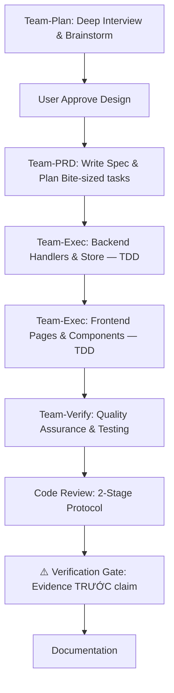
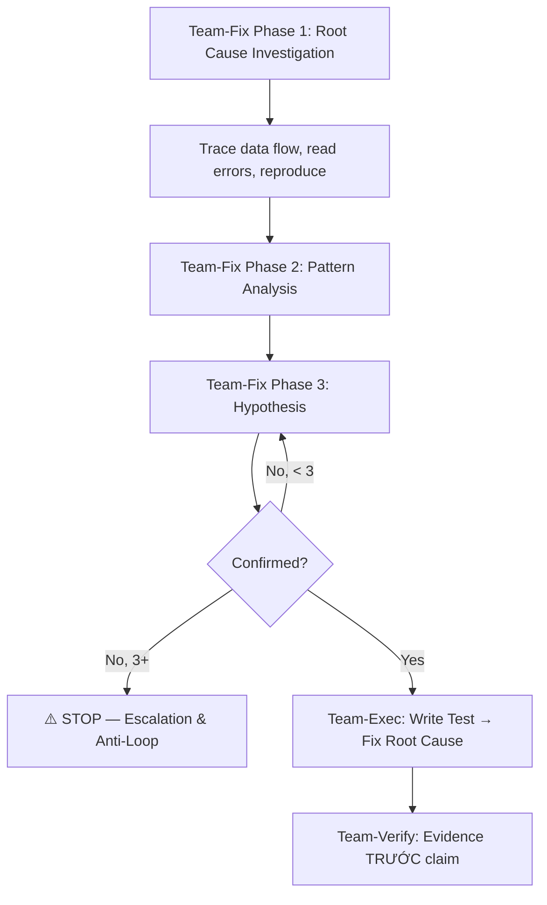

# VCT Engineering Graph (O(1) Workflow)

> **Trigger:** Tasks related to coding, database, testing, feature building, or maintenance.
> **Associated Skills:** `vct-backend`, `vct-frontend`, `vct-mobile`, `vct-database`, `vct-qa`
> **Discipline:** Mọi task M/L PHẢI tuân thủ `workflows/engineering_discipline.md` (5 Iron Laws)

## 1. Feature Node (Thêm tính năng mới)

- **Brainstorming**: Bắt buộc cho M/L. Hỏi → Đề xuất → Design → Approve
- **TDD**: NO PRODUCTION CODE WITHOUT A FAILING TEST FIRST
- **Verification**: Run command → Read output → THEN claim result
- **Backend Rules:** pgx/v5, clean architecture, authentication middleware, error wrapping.
- **Frontend Rules:** app router, `packages/ui/`, `--vct-*` css variables, Zustand 5, Zod 4, i18n keys.

## 2. Bug Fix Node (Systematic Debugging)

- **Iron Law**: NO FIXES WITHOUT ROOT CAUSE INVESTIGATION FIRST
- **Escalation**: 3+ fixes failed → STOP → Question architecture
- **Red Flags**: "Quick fix", "Just try X", "I don't understand but..."

## 3. Database Node (Quản lý Data)
- Never drop a column/table without user confirmation. Always pair up/down migrations using golang-migrate or similar.
- Use PostgreSQL. Re-index text search when changing query patterns.
- Schema changes follow TDD: Write migration test → Run → Verify → THEN apply

## 4. Code Review Node (2-Stage Protocol)
| Stage | Focus | Pass Criteria |
|-------|-------|--------------|
| **Stage 1: Spec Compliance** | Code matches requirements? | ✅ Không thiếu, không thêm |
| **Stage 2: Code Quality** | Clean, tested, maintainable? | ✅ Checklist pass |
- **Criteria:** SOLID, Blast Radius, Security > Regulation > Architecture > Business.
- **Action**: 🔴 Critical → Fix NGAY | 🟡 Major → Fix trước proceed | 🔵 Minor → Note
