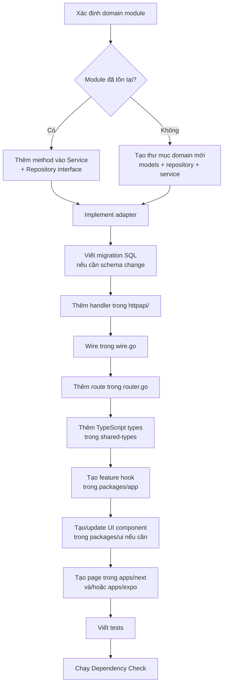

# VCT Platform — Architecture Guard Rails

> **Mục đích**: Bộ nguyên tắc bảo vệ cấu trúc dự án. Mọi code mới **PHẢI** tuân thủ tài liệu này.
> Vi phạm bất kỳ quy tắc nào dưới đây sẽ bị từ chối khi code review.

---

## 1. Dependency Rule — Quy tắc phụ thuộc

### 1.1 Nguyên tắc vàng

```
Mũi tên phụ thuộc LUÔN LUÔN hướng vào trong (inward).
Lớp bên trong KHÔNG BAO GIỜ biết sự tồn tại của lớp bên ngoài.
```

```
┌─────────────────────────────────────────────────────┐
│  HTTP Handlers / UI / CLI  (Lớp ngoài cùng)        │
│  ┌─────────────────────────────────────────────┐    │
│  │  Adapters / Infrastructure                  │    │
│  │  ┌─────────────────────────────────────┐    │    │
│  │  │  Application Services (Use Cases)   │    │    │
│  │  │  ┌─────────────────────────────┐    │    │    │
│  │  │  │  Domain (Entities + Rules)  │    │    │    │
│  │  │  └─────────────────────────────┘    │    │    │
│  │  └─────────────────────────────────────┘    │    │
│  └─────────────────────────────────────────────┘    │
└─────────────────────────────────────────────────────┘
```

### 1.2 Áp dụng cụ thể cho VCT Platform

| Lớp                | Thư mục Go                                             | Thư mục Frontend           | Được import                  |
| ------------------ | ------------------------------------------------------ | -------------------------- | ---------------------------- |
| **Domain**         | `internal/domain/*`                                    | `packages/shared-types`    | Chỉ stdlib Go / types cơ bản |
| **Application**    | `internal/domain/*/service.go`                         | `packages/app/features/*`  | Domain + interfaces          |
| **Adapter**        | `internal/adapter/`                                    | `packages/app/hooks/*`     | Domain + Application         |
| **Infrastructure** | `internal/store/`, `internal/auth/`, `internal/email/` | `apps/next/`, `apps/expo/` | Tất cả lớp bên trong         |
| **Delivery**       | `internal/httpapi/`                                    | `apps/next/app/` (routes)  | Tất cả lớp bên trong         |

### 1.3 CẤM tuyệt đối

| #   | Vi phạm                      | Ví dụ cụ thể                                          |
| --- | ---------------------------- | ----------------------------------------------------- |
| D1  | Domain import Adapter        | `domain/athlete/service.go` import `internal/adapter` |
| D2  | Domain import HTTP           | `domain/scoring/` import `net/http`                   |
| D3  | Domain import Infrastructure | `domain/tournament/` import `database/sql`            |
| D4  | Domain import 3rd-party SDK  | `domain/*/` import `github.com/jackc/pgx`             |
| D5  | Service trực tiếp gọi DB     | `Service.Create()` gọi `sql.DB.Query()`               |
| D6  | Handler chứa business logic  | `handler.go` chứa if/else nghiệp vụ phức tạp          |
| D7  | Shared-types import app code | `packages/shared-types` import `packages/app`         |
| D8  | UI package import app logic  | `packages/ui` import `packages/app/features`          |

---

## 2. Backend Go — Cấu trúc module

### 2.1 Thư mục chuẩn cho mỗi domain module

```
backend/internal/domain/<module>/
├── models.go          # Entities, Value Objects, Enums
├── repository.go      # Interface - Port ra ngoài (CẤM implementation)
├── service.go         # Application Service (business logic)
├── service_test.go    # Unit tests cho service
├── errors.go          # Domain-specific errors (optional)
└── events.go          # Domain events (optional)
```

### 2.2 Quy tắc bắt buộc

| #   | Quy tắc                                                    | Giải thích                                                     |
| --- | ---------------------------------------------------------- | -------------------------------------------------------------- |
| B1  | `repository.go` CHỈ chứa **interface**                     | Tuyệt đối không chứa struct implementation                     |
| B2  | `service.go` nhận dependency qua **constructor injection** | `NewService(repo Repository)` — không global state             |
| B3  | Implementation nằm trong `internal/adapter/`               | File đặt tên `pg_<module>_repo.go` hoặc `mem_<module>_repo.go` |
| B4  | Domain dùng **domain errors**, không dùng HTTP status code | `return domain.ErrAthleteNotFound` thay vì `404`               |
| B5  | Handler chỉ làm 3 việc: Parse → Call Service → Respond     | Không logic nghiệp vụ trong handler                            |
| B6  | Wire (DI) tập trung trong `internal/httpapi/wire.go`       | Không `new()` adapter rải rác trong handler                    |
| B7  | Models dùng Vietnamese field names theo conventions        | `HoTen`, `TrangThai`, `DoanID` — giữ consistency               |

### 2.3 Template tạo module mới

```go
// ─── backend/internal/domain/mymodule/repository.go ───
package mymodule

import "context"

type Repository interface {
    GetByID(ctx context.Context, id string) (*MyEntity, error)
    List(ctx context.Context) ([]MyEntity, error)
    Create(ctx context.Context, entity MyEntity) (*MyEntity, error)
    Update(ctx context.Context, id string, entity MyEntity) (*MyEntity, error)
    Delete(ctx context.Context, id string) error
}
```

```go
// ─── backend/internal/domain/mymodule/service.go ───
package mymodule

type Service struct {
    repo Repository    // Interface, KHÔNG phải concrete type
    uuid func() string // Function injection cho testability
}

func NewService(repo Repository, uuid func() string) *Service {
    return &Service{repo: repo, uuid: uuid}
}
```

```go
// ─── backend/internal/adapter/pg_mymodule_repo.go ───
package adapter

import "database/sql"

type PgMyModuleRepo struct {
    db *sql.DB
}

func NewPgMyModuleRepo(db *sql.DB) *PgMyModuleRepo {
    return &PgMyModuleRepo{db: db}
}
// Implement mymodule.Repository interface methods...
```

---

## 3. Frontend — Cấu trúc monorepo

### 3.1 Package dependency graph

```
apps/next ──────────┐
apps/expo ──────────┤
                    ▼
              packages/app ──────→ packages/shared-types
              (features,           (TypeScript interfaces,
               hooks,              enums, DTOs)
               navigation)              │
                    │                    │
                    ▼                    ▼
              packages/ui ────────→ packages/shared-utils
              (components,         (pure utility functions)
               design tokens)
```

### 3.2 Quy tắc phụ thuộc Frontend

| #   | Quy tắc                                                               | Chi tiết                                   |
| --- | --------------------------------------------------------------------- | ------------------------------------------ |
| F1  | `packages/shared-types` không import bất kỳ package nào khác          | Chỉ chứa TypeScript type definitions       |
| F2  | `packages/shared-utils` không import `packages/app` hay `packages/ui` | Chỉ pure functions, không React            |
| F3  | `packages/ui` không import `packages/app`                             | Components không biết business logic       |
| F4  | `packages/app` có thể import `shared-types`, `shared-utils`, `ui`     | Đây là orchestration layer                 |
| F5  | `apps/next` và `apps/expo` import từ `packages/*`                     | Không duplicate code giữa 2 apps           |
| F6  | API calls nằm trong `packages/app/features/` hoặc `hooks/`            | Không fetch trực tiếp trong page component |
| F7  | Route pages chỉ compose components                                    | `apps/next/app/*/page.tsx` — thin wrapper  |

### 3.3 Cấu trúc route page chuẩn

```
apps/next/app/<feature>/
├── page.tsx         # Server Component — data fetching + compose
├── layout.tsx       # Layout wrapper (optional)
├── loading.tsx      # Suspense fallback (optional)
├── error.tsx        # Error boundary (optional)
└── _components/     # Page-specific client components (nếu cần)
```

---

## 4. Database — Quy tắc schema

| #   | Quy tắc                                        | Giải thích                                                          |
| --- | ---------------------------------------------- | ------------------------------------------------------------------- |
| S1  | **Mọi thay đổi schema qua migration**          | Không ALTER TABLE trực tiếp trên DB                                 |
| S2  | Migration files trong `backend/db/migrations/` | Đặt tên `YYYYMMDDHHMMSS_description.up.sql` + `.down.sql`           |
| S3  | **Reference over Enum**                        | Dùng lookup table, không PostgreSQL ENUM type                       |
| S4  | **Soft-delete only**                           | `deleted_at TIMESTAMPTZ` thay vì `DELETE FROM`                      |
| S5  | **Mọi entity có `metadata JSONB`**             | Extensibility mà không cần migration                                |
| S6  | Multi-tenant qua RLS                           | Row Level Security, không filter trong application code             |
| S7  | Bitemporal design                              | `valid_from/valid_to` (business) + `created_at/updated_at` (system) |

---

## 5. Naming Conventions — Quy tắc đặt tên

### 5.1 Backend Go

| Thành phần    | Convention                           | Ví dụ                                |
| ------------- | ------------------------------------ | ------------------------------------ |
| Package       | `lowercase`, singular                | `athlete`, `scoring`, `federation`   |
| Interface     | PascalCase, noun                     | `Repository`, `Service`, `Store`     |
| Struct        | PascalCase                           | `PgAthleteRepo`, `InMemStore`        |
| Constructor   | `New` + Type name                    | `NewService()`, `NewPgAthleteRepo()` |
| Adapter file  | `pg_<module>.go` / `mem_<module>.go` | `pg_athlete_repo.go`                 |
| Handler file  | `<module>_handler.go`                | `athlete_handler.go`                 |
| Test file     | `<file>_test.go`                     | `service_test.go`                    |
| Domain errors | `Err` + Description                  | `ErrAthleteNotFound`                 |

### 5.2 Frontend TypeScript

| Thành phần     | Convention         | Ví dụ                                   |
| -------------- | ------------------ | --------------------------------------- |
| Component      | PascalCase         | `AthleteList`, `ScoreBoard`             |
| Hook           | `use` + PascalCase | `useAthletes`, `useScoring`             |
| Type/Interface | PascalCase         | `Athlete`, `Tournament`                 |
| Feature folder | kebab-case         | `athlete-profile`, `tournament-scoring` |
| API function   | camelCase          | `fetchAthletes`, `createTournament`     |
| i18n key       | dot-notation       | `athlete.list.title`, `common.save`     |

---

## 6. Cross-Cutting Concerns — Xử lý xuyên suốt

### 6.1 Nơi đặt đúng

| Concern            | Đặt ở đâu                                   | KHÔNG đặt ở                              |
| ------------------ | ------------------------------------------- | ---------------------------------------- |
| Logging            | `internal/logging/` + middleware            | Domain service                           |
| Authentication     | `internal/auth/` + middleware               | Handler body                             |
| Authorization      | `internal/authz/` + `internal/rbac/`        | Domain service                           |
| Validation (input) | Handler layer                               | Domain service (chỉ business validation) |
| Caching            | `internal/cache/` + `CachedStore` wrapper   | Direct trong handler                     |
| Rate limiting      | `internal/ratelimit/` + middleware          | Handler body                             |
| Metrics            | `internal/metrics/` + middleware            | Rải rác trong code                       |
| Error mapping      | `internal/apierror/` + `internal/envelope/` | Domain dùng HTTP codes                   |
| i18n (strings)     | `packages/app/` i18n config                 | Hardcode trong component                 |

### 6.2 Middleware chain

```
Request → RateLimit → RequestID → CORS → Auth → RBAC → Metrics → Handler
```

Thêm middleware mới: đăng ký trong `internal/httpapi/middleware.go`, chain trong `router.go`.
**KHÔNG** wrap middleware bên trong handler function.

---

## 7. Anti-patterns — Các kiểu vi phạm thường gặp

### 7.1 Backend

```go
// ❌ SAI: Domain import infrastructure
package athlete
import "database/sql"

func (s *Service) Create(ctx context.Context, db *sql.DB) { ... }

// ✅ ĐÚNG: Domain dùng interface
package athlete

func (s *Service) Create(ctx context.Context, a Athlete) (*Athlete, error) {
    return s.repo.Create(ctx, a) // repo là interface Repository
}
```

```go
// ❌ SAI: Business logic trong handler
func (h *Handler) CreateAthlete(w http.ResponseWriter, r *http.Request) {
    // ... parsing ...
    if athlete.Age < 18 && athlete.Category == "ProFight" {
        // Business rule KHÔNG nên ở đây
    }
}

// ✅ ĐÚNG: Handler chỉ delegate
func (h *Handler) CreateAthlete(w http.ResponseWriter, r *http.Request) {
    var req CreateAthleteRequest
    if err := json.NewDecoder(r.Body).Decode(&req); err != nil {
        respondError(w, err); return
    }
    result, err := h.athleteService.Create(r.Context(), req.ToDomain())
    if err != nil {
        respondError(w, err); return
    }
    respondJSON(w, http.StatusCreated, result)
}
```

### 7.2 Frontend

```tsx
// ❌ SAI: API call trực tiếp trong page component
export default function AthletesPage() {
  const [data, setData] = useState([])
  useEffect(() => {
    fetch('/api/athletes')
      .then((r) => r.json())
      .then(setData)
  }, [])
}

// ✅ ĐÚNG: Dùng hook từ packages/app
import { useAthletes } from '@vct/app/features/athletes'

export default function AthletesPage() {
  const { data, isLoading } = useAthletes()
  return <AthleteList athletes={data} loading={isLoading} />
}
```

```tsx
// ❌ SAI: UI component chứa business logic
// packages/ui/src/AthleteCard.tsx
import { calculateBeltLevel } from '@vct/app/features/training' // Vi phạm F3!

// ✅ ĐÚNG: UI component nhận data qua props
// packages/ui/src/AthleteCard.tsx
interface AthleteCardProps {
  name: string
  beltLevel: string // Đã tính sẵn bởi app layer
}
```

---

## 8. Checklist trước khi commit

### 8.1 Dependency Rule Check (bắt buộc)

- [ ] File `domain/*/` KHÔNG import `adapter/`, `httpapi/`, `store/`, `auth/`, `email/`
- [ ] File `domain/*/` KHÔNG import `database/sql`, `net/http`, `github.com/jackc/*`
- [ ] File `domain/*/repository.go` CHỈ chứa interface, không struct
- [ ] Handler CHỈ parse → call service → respond
- [ ] Adapter implement đúng interface đã define trong domain

### 8.2 Structure Check (bắt buộc)

- [ ] Module mới có đủ: `models.go`, `repository.go`, `service.go`
- [ ] Adapter mới nằm trong `internal/adapter/`, tên file `pg_<module>.go`
- [ ] Handler mới nằm trong `internal/httpapi/`, tên file `<module>_handler.go`
- [ ] DI wiring cho module mới trong `wire.go`
- [ ] Migration file có cả `.up.sql` và `.down.sql`

### 8.3 Frontend Check (bắt buộc)

- [ ] `packages/shared-types` không import package khác
- [ ] `packages/ui` không import `packages/app`
- [ ] API call nằm trong feature hook, không trong page component
- [ ] Component mới có TypeScript types đầy đủ
- [ ] i18n keys đã thêm cho cả `vi` và `en`

---

## 9. Quy trình thêm feature mới



---

## 10. Automated enforcement (khuyến nghị)

### 10.1 Go: Kiểm tra import violations

```bash
# Chạy trước mỗi commit — phát hiện domain import infrastructure
grep -rn "database/sql\|net/http\|github.com/jackc" backend/internal/domain/ && echo "❌ VIOLATION" || echo "✅ CLEAN"

# Kiểm tra domain không import adapter
grep -rn '"vct-platform/backend/internal/adapter"' backend/internal/domain/ && echo "❌ VIOLATION" || echo "✅ CLEAN"

# Kiểm tra domain không import httpapi
grep -rn '"vct-platform/backend/internal/httpapi"' backend/internal/domain/ && echo "❌ VIOLATION" || echo "✅ CLEAN"
```

### 10.2 Frontend: Kiểm tra package boundaries

```bash
# shared-types không import packages khác
grep -rn "@vct/app\|@vct/ui\|@vct/shared-utils" packages/shared-types/src/ && echo "❌ VIOLATION" || echo "✅ CLEAN"

# UI không import app
grep -rn "@vct/app" packages/ui/src/ && echo "❌ VIOLATION" || echo "✅ CLEAN"
```

### 10.3 CI Pipeline check (tương lai)

Thêm step trong GitHub Actions:

```yaml
- name: Architecture Guard Rails
  run: |
    # Domain must not import infrastructure
    if grep -rn 'database/sql\|net/http\|github.com/jackc' backend/internal/domain/; then
      echo "::error::Dependency Rule violation in domain layer"
      exit 1
    fi
    # Domain must not import adapter/httpapi
    if grep -rn '"vct-platform/backend/internal/adapter"\|"vct-platform/backend/internal/httpapi"' backend/internal/domain/; then
      echo "::error::Domain imports outer-layer packages"
      exit 1
    fi
```

## 11. Testing Guard Rails

### 11.1 Vị trí và Cấp độ Test

| Loại Test            | Thư mục                     | Quy tắc bắt buộc                                                                                                                  |
| -------------------- | --------------------------- | --------------------------------------------------------------------------------------------------------------------------------- |
| **Unit Test**        | `internal/domain/<module>/` | Test business logic tinh khiết trong `service.go`. KHÔNG có I/O gốc, database hay network. Phải kèm file `_test.go` cùng thư mục. |
| **Integration Test** | `internal/adapter/`         | Test SQL query, redis cache, NATS pub/sub. Chạy với database thật (container/in-memory).                                          |
| **Handler Test**     | `internal/httpapi/`         | Dùng `httptest` để test input validation, route mapping, request/response format và status code.                                  |
| **E2E Test**         | `tests/` (root)             | Test flow người dùng thật từ Frontend (Playwright) gọi qua Backend API.                                                           |

### 11.2 Anti-patterns trong Test

- ❌ **Mocking database interfaces quá phức tạp**: Thay vì tự tạo mocks cồng kềnh, dùng In-Memory adapter cho Unit Test.
- ❌ **Phụ thuộc thứ tự chạy test**: Mỗi test case phải khởi tạo data riêng biệt và teardown sau khi chạy.
- ❌ **Testing implementation details**: Test output của Service, không test cách Service gọi function A hay function B bên trong.

---

## 12. Git & PR Conventions

### 12.1 Branch Naming

Sử dụng định dạng chuẩn: `<type>/<issue-number>-<short-description>`

| Type        | Ý nghĩa                    | Ví dụ                                  |
| ----------- | -------------------------- | -------------------------------------- |
| `feat/`     | Tính năng mới              | `feat/123-add-athlete-scoring`         |
| `fix/`      | Sửa bug                    | `fix/456-resolve-bracket-crash`        |
| `hotfix/`   | Sửa gấp production         | `hotfix/login-timeout`                 |
| `refactor/` | Sửa code không đổi feature | `refactor/789-extract-button-ui`       |
| `docs/`     | Cập nhật tài liệu          | `docs/update-architecture-guard-rails` |

### 12.2 Commit Message Format

Tuân thủ Conventional Commits:

```
<type>(<scope>): <subject>

<body>

<footer>
```

- **❌ SAI**: `fix bug`, `update code`, `wip`
- **✅ ĐÚNG**: `fix(scoring): prevent negative score submission in point-fighting`

### 12.3 PR Requirements

1. PR phải điền đầy đủ template mô tả thay đổi.
2. PR thay đổi UI/UX **bắt buộc** đính kèm screenshot hoặc video.
3. PR thay đổi Backend API **bắt buộc** cập nhật `api-design.md` hoặc Swagger.
4. CI pipeline (Lint, Build, Test) phải pass 100%.

---

## 13. Performance Guard Rails

### 13.1 Database & API

| #   | Quy tắc                  | Giải pháp buộc phải làm                                                                  |
| --- | ------------------------ | ---------------------------------------------------------------------------------------- |
| P1  | **N+1 Query Ban**        | CẤM loop thực hiện DB query. Bắt buộc dùng SQL JOIN hoặc chạy 1 câu `WHERE id IN (...)`. |
| P2  | **Mandatory Pagination** | Mọi API trả về danh sách (> 50 items) BẮT BUỘC phải có Limit/Offset hoặc Cursor.         |
| P3  | **Timeout Context**      | Mọi lệnh gọi DB, Cache, External API phải truyền `ctx` có timeout.                       |
| P4  | **Index Coverage**       | Query lọc theo trường nào (`WHERE club_id = ?`) thì trường đó phải có index.             |

### 13.2 Frontend

| #   | Quy tắc                     | Giải pháp buộc phải làm                                                                       |
| --- | --------------------------- | --------------------------------------------------------------------------------------------- |
| P5  | **No Heavy Imports**        | Không import toàn bộ thư viện (VD: lodash, icons). Chỉ import submodule cần thiết.            |
| P6  | **Image Optimization**      | Bắt buộc dùng `next/image` hoặc CDN Expo Image. Không map ảnh gốc quá 2MB lên giao diện list. |
| P7  | **Memoization chặn render** | Các component nặng dính vào list lớn bắt buộc bọc `React.memo` và kiểm soát props.            |

---

## 14. Security Guard Rails

### 14.1 Data & Input Protection

- **SQL Injection Prevention**: TUYỆT ĐỐI KHÔNG nối chuỗi SQL. Bắt buộc dùng parameterized queries (`$1`, `$2` trong `pgx`) hoặc ORM/Query Builder.
- **XSS Prevention**: Frontend phải escape HTML (mặc định của React). Nếu phải parse rich text, bắt buộc dùng thư viện sanitize (như DOMPurify).
- **IDOR Prevention (Insecure Direct Object Reference)**: Mọi endpoint lấy sửa xóa theo ID (`GET /athletes/:id`) đều phải kiểm tra quyền sở hữu hoặc quyền của role đó đối với ID đang thao tác (Tenant Isolation).

### 14.2 Secrets & Configuration

- **NO SECRETS IN CODE**: Không hardcode API keys, passwords, JWT secrets vào mã nguồn. Bắt buộc dùng `.env` hoặc hệ thống quản lý Secret.
- **DO NOT log PII**: Cấm in thông tin nhạy cảm (mật khẩu, sđt, email, token) ra server logs. Dùng struct tags để trigger hàm masking khi log.

## 15. Observability & Logging Guard Rails

Hệ thống bắt buộc phải dễ dàng debug khi chạy trên production.

### 15.1 Quy tắc Log Level

- **ERROR (`slog.Error`)**: Bắt buộc phải có lỗi thực sự (DB down, Panic, 3rd party API fail) mà engineer cần can thiệp ngay.
- **WARN (`slog.Warn`)**: Lỗi hệ thống có thể tự phục hồi (VD: Retry thành công, Request rate-limited).
- **INFO (`slog.Info`)**: Audit trail, state transition, hoặc system start/stop. Không log INFO bừa bãi trong mỗi function call.
- **DEBUG (`slog.Debug`)**: Dữ liệu chi tiết quá trình xử lý (SQL queries, raw API responses). Sẽ bị tắt trên Production.

### 15.2 Structural Trait (Đặc tính cấu trúc)

- **CẤM** dùng `fmt.Println()`, `log.Printf()` trong production code backend. Mọi log bắt buộc dùng instance của `slog.Logger`.
- **Traceability**: Mọi log trong phạm vi của 1 HTTP Request BẮT BUỘC phải đính kèm `request_id`. (Đã được tự động xử lý bởi middleware, chỉ cần truyền đúng `ctx` vào hàm).

---

## 16. Frontend State Management Guard Rails

Bảo vệ hiệu suất Render của React/Next.js/Expo bằng cách phân tách rõ ràng các loại State.

### 16.1 Server State vs Client State

- **Server State (Dữ liệu API trả về)**: Danh sách giải đấu, thông tin VĐV, lịch thi đấu. Bắt buộc quản lý qua `SWR` hoặc state được hydrate từ Server Components.
  - ❌ CẤM tự fetch bằng `fetch()` rồi call `setState(data)` trong `useEffect`.
  - ✅ VCT Platform chuẩn hóa việc dùng custom hooks (VD: `useAthleteList()`).
- **Client Global State**: Trạng thái UI dùng chung (Sidebar mở/đóng, Active Workspace, Theme).
  - ✅ Chỉ dùng `Zustand` (hoặc Context API rất nhẹ) cho mục đích này. Tránh Context Hell.
- **Local State**: Trạng thái form đang nhập, dropdown đang mở.
  - ✅ Dùng `useState` hoặc `useReducer` độc lập trong chính component đó. Không đưa lên Global State.

---

## 17. Error Handling & Recovery Guard Rails

### 17.1 Backend Error Envelope

Khung báo lỗi gửi về Client phải nhất quán tuyệt đối. Toàn bộ mã lỗi phải lấy ra từ `internal/apierror/`.

- ❌ **CẤM** trả HTTP 200 `{"success": false, "error": "Lỗi gì đó"}`.
- ✅ Lỗi nhập liệu do client sai: HTTP `400 Bad Request`.
- ✅ Lỗi tìm không thấy resource (`ID VĐV không có`): HTTP `404 Not Found`.
- ✅ Lỗi Logic Domain (VD: `Chưa nạp đủ tiền`): HTTP `422 Unprocessable Entity` + Domain Error Code.
- ✅ Lỗi hệ thống tắt đứt kết nối DB: HTTP `500 Internal Server Error`. Lỗi do dev tạo ra KHÔNG được phép rò rỉ stack trace ra JSON response.

### 17.2 Frontend Graceful Degradation

Lỗi cục bộ không được làm chết cả ứng dụng.

- BẮT BUỘC sử dụng `Error Boundary` (file `error.tsx` trong Next.js App Router) để bao bọc các phân khu UI khác nhau.
- Nếu Widget "Bảng Xếp Hạng" bị lỗi khi fetch, nó chỉ hiện fallback error cục bộ "Không tải được bảng xếp hạng". Toàn bộ trang web (Gồm Sidebar, Header, Form Chính) vẫn **PHẢI** hoạt động bình thường.

## 18. Multi-Tenancy & Data Isolation Guard Rails

VCT Platform phục vụ hàng ngàn câu lạc bộ và liên đoàn trên cùng một DB (Multi-tenant). Việc rò rỉ dữ liệu chéo là thảm họa bảo mật.

### 18.1 Isolation Rules (Quy tắc cách ly)

- **Mandatory Tenant Context**: Mọi API lấy/sửa dữ liệu phải gắn chặt với `TenantID` hoặc `FederationID` của user hiện tại.
  - ❌ CẤM truy vấn trần (VD: `SELECT * FROM athletes;`).
  - ✅ BẮT BUỘC kẹp điều kiện Tenant (VD: `SELECT * FROM athletes WHERE club_id = $1;`).
- **Row-Level Security (RLS)**: Database phải bật RLS. Dù developer có quên thêm `WHERE club_id` trong code Go, DB Server cũng sẽ tự động chặt đứt câu query nếu user không có quyền với row đó.

### 18.2 Permission Rules (Quy tắc phân quyền)

- Cấm hardcode quyền kiểm tra bằng chuỗi cứng trong business logic (VD: `if user.role == "SystemAdmin"`).
- Bắt buộc kiểm tra quyền dựa trên **Hành động** (Action-based RBAC) thông qua middleware hoặc helper: `if !authz.Can(ctx, "create:tournament") { return ErrForbidden }`.
- **Frontend Permission Hooks**: Mọi nút bấm nhạy cảm (Xóa dữ liệu, Duyệt thành viên) BẮT BUỘC bọc trong component `<Can perform="delete:tournament">` hoặc logic hook để tàng hình khi User không có quyền.

---

## 19. Real-time & WebSocket Guard Rails

Bảo vệ tính toàn vẹn của hệ thống Live Scoring và Notifications.

### 19.1 Backend WebSocket Rules

- **Stateless Hubs**: WebSocket Hub **KHÔNG BAO GIỜ** được lưu trữ State (lịch sử điểm, trạng thái trận). Nếu Hub bị crash/restart, State phải được lấy lại toàn bộ từ Database hoặc Redis.
- **Event-Driven Push**: Không push dữ liệu trực tiếp trong luồng lưu DB của HTTP Handler.
  - ✅ **Chuẩn**: HTTP Handler lưu điểm vào DB -> Phát Event nội bộ (`match.scored`) qua NATS/EventBus -> WebSocket Hub lắng nghe EventBus -> WebSocket Hub push JSON xuống Client.

### 19.2 Frontend WebSocket Rules

- **Throttling & Batching**: Cấm component (VD: Lịch thi đấu trực tiếp) re-render ngay lập tức mỗi khi nhận được 1 event từ Socket nếu event đến quá dồn dập (> 5 msg/s).
  - Bắt buộc dùng Throttling/Debouncing hoặc update qua Store Queue (Zustand) để gom nhóm render mỗi 500ms.
- **Graceful Reconnection**: Frontend bắt buộc phải có logic tự động kết nối lại (Exponential Backoff) nếu rớt Socket. Khi kết nối lại thành công, **PHẢI** fetch lại dữ liệu mới nhất (HTTP GET) để bù đắp các event bị rớt mạng ở giữa.

---

## 20. CI/CD & Deployment Strategy Guard Rails

Đảm bảo VCT Platform có thể release tính năng giữa ban ngày mà không làm gián đoạn người dùng.

### 20.1 Zero-Downtime Migration (Chuyển đổi không downtime)

- **KHÔNG BAO GIỜ** sử dụng `ALTER TABLE RENAME COLUMN` hoặc `DROP COLUMN` trực tiếp. Code cũ chạy song song sẽ bị crash.
- Mọi thay đổi phá vỡ (Breaking Schema Change) TỘT ĐỘNG CHUẨN 4 BƯỚC:
  1. **Thêm cột mới**: Update Backend ghi dữ liệu vào cả cột cũ và cột mới.
  2. **Backfill**: Chạy Script migrate dữ liệu từ cột cũ sang cột mới.
  3. **Switch Read**: Chuyển Backend sang chỉ đọc và ghi từ cột mới.
  4. **Cleanup**: Drop cột cũ (vào đợt release sau).

### 20.2 Trunk-Based & Feature Flags

- **No Long-Living Branches**: Tất cả developer phải push code merge ngược về nhánh `main` thường xuyên (chậm nhất mỗi 2 ngày).
- Mọi tính năng lớn/chưa hoàn thiện (Epic, Hệ thống mới) khi merge vào `main` bắt buộc phải bọc trong **Feature Flag** (VD: `ENABLE_NEW_BRACKET_UI=false`). Đảm bảo code chết nằm an toàn trên production nhưng user không thấy được, cho tới khi Business cho phép bật flag.

## 21. Technical Debt & Refactoring Guard Rails (Ngăn chặn Rác Code)

### 21.1 Quy tắc Hướng Đạo Sinh (Boy Scout Rule)

- Bất cứ khi nào bạn mở 1 file để sửa bug hoặc thêm tính năng, nếu thấy code cũ đang vi phạm Guard Rails, **BẮT BUỘC** phải refactor dọn dẹp file đó trước khi commit. "Luôn để lại khu vực code sạch hơn lúc bạn đến".

### 21.2 Lệnh cấm `// TODO` vô thời hạn

- Bất kỳ comment `// TODO` hoặc `// FIXME` nào trong code đều phải kèm theo số Issue hoặc link ticket Jira/Linear.
- Ví dụ: ❌ Sai: `// TODO: Chuyển sang dùng Redis`. ✅ Đúng: `// TODO(#123): Rút trích Cache thành Service riêng`.
- Chặn merge PR nếu phát hiện `TODO` mồ côi (không assignee, không ticket).

---

## 22. Component UI / Design System Guard Rails (Bảo vệ Đồng nhất Giao diện)

### 22.1 Cấm Hardcode Colors & Spacing

- Mọi giá trị màu sắc, độ lớn chữ, viền, khoảng cách (margin/padding) BẮT BUỘC phải trích xuất từ **Design Tokens** (Theme) của VCT Platform.
- ❌ CẤM dùng inline style cứng: `style={{ color: '#FF0000', margin: 15 }}`
- ✅ Chỉ định thông qua Utils hoặc Token vars của Tailwind/Tamagui.

### 22.2 Single Component Catalog

- Ranh giới tái sử dụng: Nếu dự án đã có 1 `<Button />` trong `packages/ui`, **BẮT BUỘC** phải import để dùng.
- TUYỆT ĐỐI KHÔNG được tự viết 1 nút bấm hay thẻ Card custom vứt trong folder tính năng riêng lẻ (`apps/next/app/my-feature/CustomButton.tsx`), dẫn đến việc cả platform có 15 cái nút bấm màu sắc lệch nhau.

---

## 23. Configuration & Environment Parity (Bảo mật Môi trường)

### 23.1 Cấm "Default Fallback" cho Secret Keys

- File code **KHÔNG ĐƯỢC PHÉP** tự gán giá trị mặc định cho những biến cực kỳ nhạy cảm nếu thiếu file `.env`.
- ❌ Sai: `jwtSecret := os.Getenv("JWT_SECRET"); if jwtSecret == "" { jwtSecret = "default_secret" }`
- ✅ Đúng: App phải **Fail Fast** ngay lúc khởi động (Panic) kèm log báo lỗi "Thiếu biến môi trường JWT_SECRET".

### 23.2 Tương đương Môi trường (Environment Parity)

- Local Dev, Staging và Production phải dùng chung kiến trúc Cơ sở dữ liệu (PostgreSQL) cốt lõi (có thể chạy qua Docker Compose ở Local).
- ❌ Cấm hành vi Dev dùng SQLite dưới máy ảo Local cho máy chạy nhẹ, nhưng Production lại là PostgreSQL. DB Driver khác nhau sẽ sinh sinh ra những bug tiềm ẩn không thể debug nổi.

---

## 24. Internationalization (i18n) Guard Rails (Đa ngôn ngữ)

Nền tảng Liên đoàn Thể thao Quốc gia/Quốc tế bắt buộc phải phục vụ đa ngôn ngữ hoàn hảo.

### 24.1 No Hardcoded Strings (Cấm Hardcode UI Text)

- Tuyệt đối **CẤM** gõ trực tiếp Tiếng Việt/Tiếng Anh dạng raw string hiển thị cho user trong file Code (`<button>Đăng nhập</button>`).
- ✅ Bắt buộc dùng Dictionary (VD: thông qua `next-intl` ở frontend): `<button>{t('auth.login')}</button>`.

### 24.2 Error Translation (Biến dịch Lỗi)

- Backend **KHÔNG ĐƯỢC** trả về chuỗi báo lỗi ngôn ngữ tự nhiên: `{"message": "Vận động viên không tồn tại"}`.
- ✅ Backend phải trả về Application Error Code: `{"code": "ERR_ATHLETE_NOT_FOUND"}`. Frontend tự map mã lỗi lấy từ bản dịch tương ứng.

---

## 25. Accessibility (a11y) Guard Rails (Tiếp cận thân thiện)

Đảm bảo nền tảng Web VCT có thể sử dụng được bởi tất cả mọi người (kể cả người khiếm thị / không dùng chuột).

### 25.1 Keyboard Navigable (Điều hướng bằng Phím)

- Mọi interactive component (Button, Input, Dropdown, Modal, Tabs) **BẮT BUỘC** phải Focus được và tương tác được bằng phím `Tab`, `Arrow Keys`, `Enter`, `Space` và `Esc`.

### 25.2 Semantic HTML & ARIA (Đúng ngữ nghĩa)

- ❌ Cấm dùng thẻ div thay cho button: `<div onClick={submit}>Gửi</div>` (Không thể nhận focus, screen reader không đọc được).
- ✅ Dùng semantic tags (`<button>`, `<nav>`, `<article>`) và bổ sung thuộc tính `aria-label="Đóng"` cho các nút bấm chỉ có Icon.

---

## 26. Data Privacy & Compliance Guard Rails (Bảo mật thông tin cá nhân)

Lưu trữ thông tin nhạy cảm của hàng ngàn võ sư/võ sinh cần tuân thủ luật bảo mật dữ liệu.

### 26.1 PII Masking (Che giấu dữ liệu nhạy cảm)

- Khi log request/response HTTP trên Server, **MẶC ĐỊNH** phải tự động che (mask) các trường dữ liệu cá nhân (CCCD, Mật khẩu, Số điện thoại, Email, Token) thành `***` trước khi xuất log ra Console/System Log.

### 26.2 Right to be Forgotten (Quyền được lãng quên)

- Dù toàn bộ hệ thống áp dụng thiết kế Soft-Delete (`deleted_at`), vẫn phải thiết kế 1 tác vụ chạy ngầm (Background Worker) để **Hard Delete** hoặc **Anonymize** (Vô danh hóa: Đổi tên thành "Deleted User") sau 30-90 ngày kể từ khi có yêu cầu đóng/xóa tài khoản vĩnh viễn từ người dùng, tránh vi phạm các luật về rò rỉ dữ liệu cũ.

---

## Tham khảo

- [Clean Architecture — Robert C. Martin](https://blog.cleancoder.com/uncle-bob/2012/08/13/the-clean-architecture.html)
- [Dependency Rule](https://khalilstemmler.com/wiki/dependency-rule/)
- [Go Project Layout](https://github.com/golang-standards/project-layout)
- VCT Platform Architecture Overview: [`docs/architecture/overview.md`](file:///d:/VCT%20PLATFORM/vct-platform/docs/architecture/overview.md)
