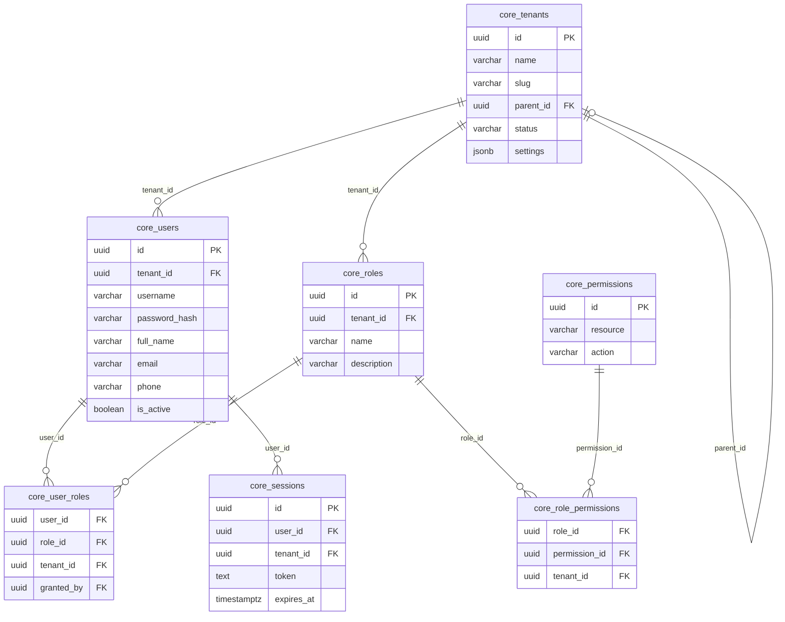
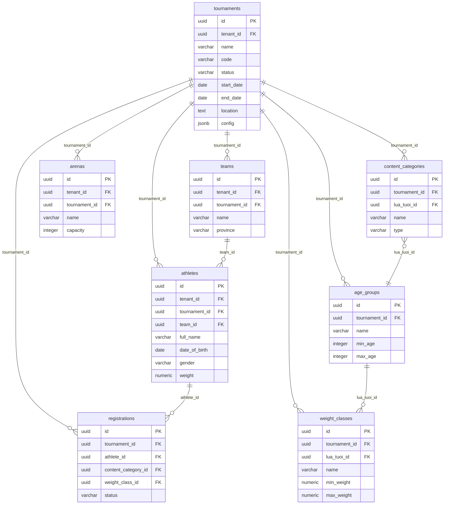
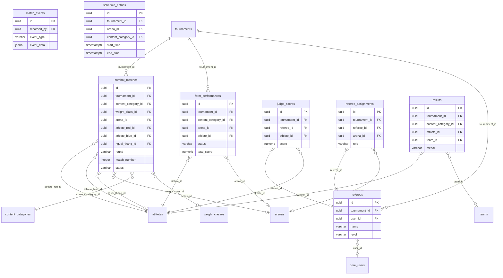
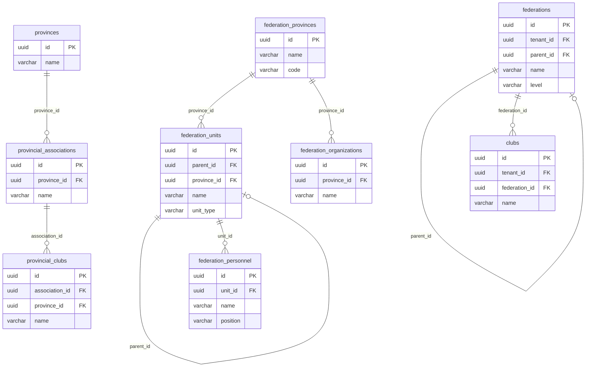
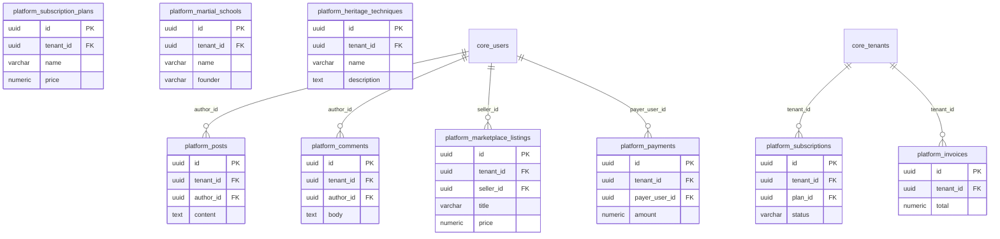
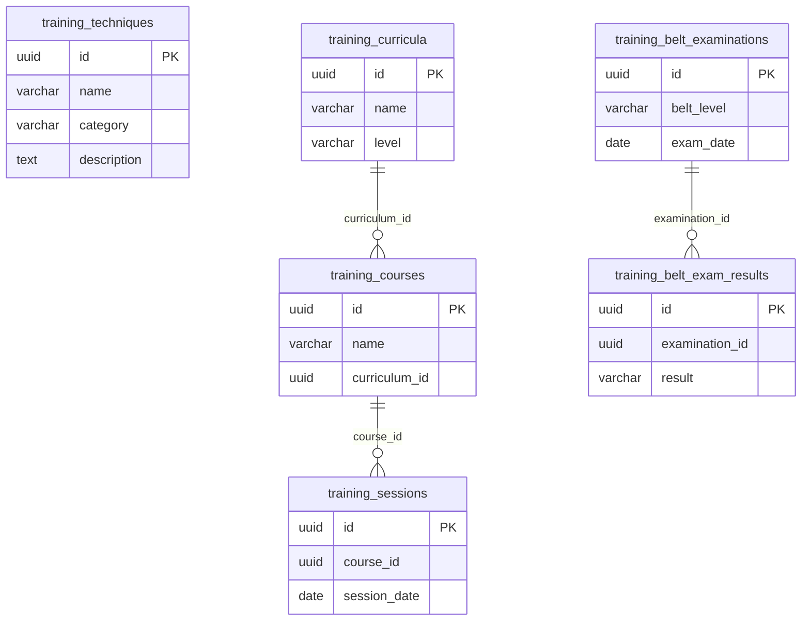
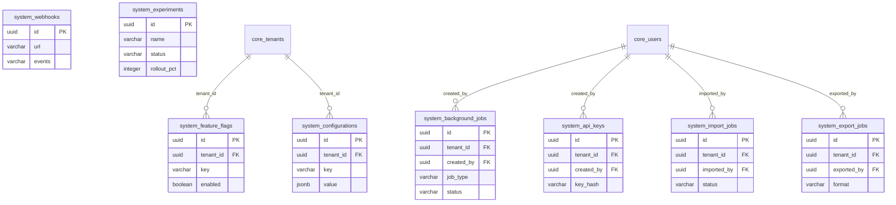
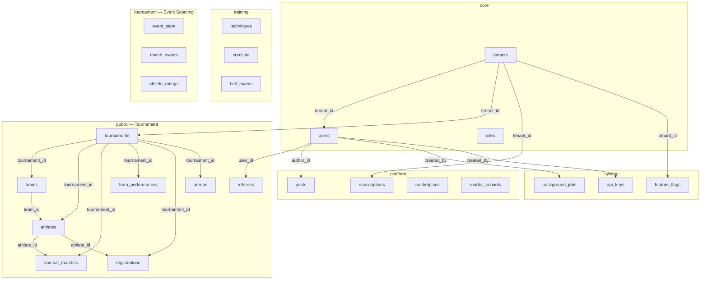

# VCT Platform — Database ERD & Schema Overview

> **381 bảng** · **11 schemas** · **1,319 foreign keys** · PostgreSQL trên Supabase

---

## Tổng quan Schemas

| Schema | Số bảng | Mô tả |
|--------|---------|-------|
| `public` | 88 | Nghiệp vụ giải đấu chính (VĐV, trận đấu, đăng ký, kết quả) |
| `core` | 34 | Identity & multi-tenancy (users, roles, tenants, approval) |
| `system` | 126 | Hạ tầng nội bộ (audit log, jobs, feature flags, notifications, A/B testing) |
| `platform` | 31 | Tài chính, cộng đồng, di sản, marketplace |
| `tournament` | 29 | Event sourcing & scoring nâng cao |
| `training` | 12 | Đào tạo, kỹ thuật, đai, chương trình giảng dạy |
| `people` | 6 | Câu lạc bộ chi nhánh, thành viên, chứng chỉ |
| `temporal` | 4 | Temporal history tracking |
| `archive` | 10 | Lưu trữ dữ liệu theo quý |
| `ml` | 6 | Machine Learning (model registry, predictions) |
| `api_v1` | — | Views phục vụ API (không phải base tables) |

---

## 1. Core Identity & Multi-Tenancy

---

## 2. Giải đấu (Tournament Core)

---

## 3. Thi đấu & Chấm điểm

---

## 4. BTC (Ban Tổ Chức) — Quản lý giải

```mermaid
erDiagram
    btc_members {
        uuid id PK
        uuid tournament_id FK
        varchar ho_ten
        varchar chuc_vu
    }
    btc_assignments {
        uuid id PK
        uuid tournament_id FK
        varchar noi_dung
    }
    btc_draws {
        uuid id PK
        uuid tournament_id FK
        jsonb draw_data
    }
    btc_weigh_ins {
        uuid id PK
        uuid tournament_id FK
        numeric can_nang
    }
    btc_meetings {
        uuid id PK
        uuid tournament_id FK
        text noi_dung
    }
    btc_protests {
        uuid id PK
        uuid tournament_id FK
        text ly_do
    }
    btc_finance {
        uuid id PK
        uuid tournament_id FK
        numeric so_tien
    }
    btc_content_results {
        uuid id PK
        uuid tournament_id FK
    }
    btc_team_results {
        uuid id PK
        uuid tournament_id FK
    }

    tournaments ||--o{ btc_members : "tournament_id"
    tournaments ||--o{ btc_assignments : "tournament_id"
    tournaments ||--o{ btc_draws : "tournament_id"
    tournaments ||--o{ btc_weigh_ins : "tournament_id"
    tournaments ||--o{ btc_meetings : "tournament_id"
    tournaments ||--o{ btc_protests : "tournament_id"
    tournaments ||--o{ btc_finance : "tournament_id"
    tournaments ||--o{ btc_content_results : "tournament_id"
    tournaments ||--o{ btc_team_results : "tournament_id"
```

---

## 5. Liên đoàn & Tổ chức

---

## 6. Platform Services

---

## 7. Training & Heritage

---

## 8. System Infrastructure

---

## 9. Sơ đồ tổng quan liên kết giữa các Schema

---

## Thống kê Foreign Keys theo Schema

| Schema | Unique FKs | Ghi chú |
|--------|-----------|---------|
| `core` | 31 | Chủ yếu liên kết tenants ↔ users ↔ roles |
| `public` | 89 | Trung tâm nghiệp vụ: tournaments là hub chính |
| `platform` | 35 | Liên kết core.users + core.tenants |
| `system` | 40+ | Nhiều partitioned tables tạo FKs trùng lặp |
| `people` | 6 | Đều FK tới core.tenants |
| `training` | 0 | Chưa có FK (tự quản lý) |
| `ml` | 3 | predictions → model_registry |

> **Lưu ý**: Tổng 1,319 FK bao gồm nhiều bản sao từ các **partitioned tables** (mỗi partition kế thừa FK của bảng cha). Số FK thực tế unique khoảng ~160.
