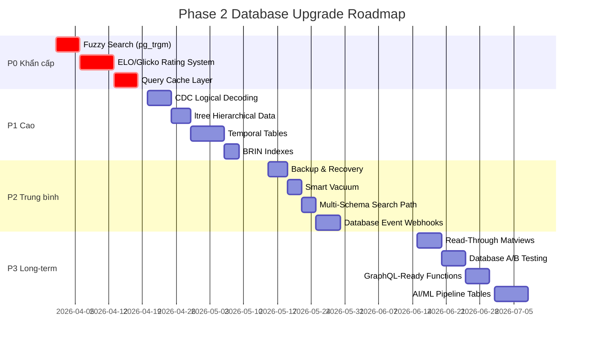

# 🚀 Đề Xuất Nâng Cấp Database — Phase 2

> **Ngày:** 2026-03-16  
> **Phase:** 2 (sau Phase 1: migrations 0049–0058)  
> **Phạm vi:** Nâng cao tính năng chuyên sâu chưa có trong hệ thống

---

## 📊 Inventory — Đã Có vs Chưa Có

### ✅ Phase 1 đã triển khai (0049–0058)
Tenant isolation, FK constraints, schema consolidation, auto-partition, composite indexes, matview refresh, audit v2, observability, archival pipeline, test data, schema validation.

### ✅ Đã có từ trước (0001–0048)
Event sourcing/CQRS, circuit breaker, feature flags, JSONB validation, bulk import, i18n, versioned config, cursor pagination, deadlock prevention, search path security, GIN indexes, row estimation, DB roles/grants, long-query killer, PII encryption, advisory locks, approval workflows, webhooks, announcements.

### ❌ Chưa có — Đề xuất Phase 2:

---

## 🔴 P0 — Khẩn Cấp

### 1. Fuzzy Search (pg_trgm) — Tìm Kiếm Tên Tiếng Việt

> [!IMPORTANT]
> Hiện tại FTS chỉ hỗ trợ exact word matching. Người dùng nhập "Ngyen" thay vì "Nguyễn" → không có kết quả.

**Vấn đề:** `unaccent + tsvector` chỉ tìm được từ đúng chính tả. Cần fuzzy matching cho tên người, CLB, trường phái.

**Đề xuất:**
- Extension `pg_trgm` cho trigram similarity search
- Trigram GIN indexes trên tên VĐV, HLV, CLB, trường phái
- Hàm `search_fuzzy()` trả kết quả ranked theo similarity score
- Threshold configurable (mặc định 0.3 = 30% match)

### 2. ELO/Glicko Rating System — Hệ Thống Xếp Hạng

> [!IMPORTANT]
> Bảng `rankings` tồn tại nhưng chỉ lưu points tĩnh. Chưa có thuật toán tính rating tự động sau mỗi trận.

**Đề xuất:**
- Bảng `athlete_ratings` lưu ELO/Glicko-2 rating per weight class
- Bảng `rating_history` track thay đổi sau mỗi trận (bitemporal)
- Function `calculate_elo()` tự động trigger sau match kết thúc
- Decay function cho VĐV không thi đấu >6 tháng
- Leaderboard materialized view per weight class

### 3. Intelligent Query Cache Layer

> [!WARNING]
> Tất cả queries hiện tại đi thẳng vào PostgreSQL. Cần cache layer cho reference data và public listings.

**Đề xuất:**
- Bảng `system.query_cache` lưu pre-computed results
- Function `cached_query()` check cache trước khi query
- Auto-invalidation triggers khi data thay đổi
- TTL configurable per entity type
- Cache hit/miss metrics view

---

## 🟠 P1 — Ưu Tiên Cao

### 4. Change Data Capture (CDC) — Logical Decoding

**Mục tiêu:** Stream database changes ra external systems (search index, analytics, notifications) mà không cần polling.

**Đề xuất:**
- Publication cho critical tables
- Logical replication slot setup
- CDC events table cho downstream consumers
- Integration config cho MeiliSearch, analytics pipeline

### 5. ltree Extension — Hierarchical Data

**Mục tiêu:** Hiện tại tree queries dùng recursive CTE (0021) → chậm trên cây sâu. `ltree` native performance tốt hơn.

**Đề xuất:**
- `ltree` column cho `federations`, `martial_schools`, `community_groups`
- Automatic path maintenance triggers
- Index `USING GIST (path ltree_ops)` cho ancestor/descendant queries
- Function `get_subtree()`, `get_ancestors()` dùng ltree operators

### 6. Temporal Tables — System-Versioned History

**Mục tiêu:** Track lịch sử thay đổi TOÀN BỘ row (not just audit log) cho compliance và "time travel" queries.

**Đề xuất:**
- `_history` tables cho: `athletes`, `tournaments`, `combat_matches`
- Trigger-based system versioning (valid_from, valid_to)
- `AS OF` query function — xem snapshot tại thời điểm bất kỳ
- Automatic cleanup old history entries

### 7. BRIN Indexes — Large Sequential Tables

**Mục tiêu:** BRIN indexes nhỏ hơn B-tree 100x cho cột sequential (created_at, recorded_at).

**Đề xuất:**
- BRIN trên `created_at` cho tất cả bảng >10K rows
- BRIN trên `recorded_at` cho event_store, audit_log
- View kiểm tra BRIN coverage tự động

---

## 🟡 P2 — Trung Bình

### 8. Database Backup & Recovery Procedures

**Đề xuất:**
- Function `system.create_backup_checkpoint()` — ghi metadata trước migration
- Recovery point tracking table
- Neon branch-based backup strategy with naming convention
- Automated pre-migration branching

### 9. Smart Vacuum & Analyze Scheduling

**Đề xuất:**
- Per-table vacuum configuration (high-churn tables cần aggressive vacuum)
- Custom auto-analyze thresholds cho bảng lớn
- Vacuum progress monitoring view
- Alert khi bloat vượt ngưỡng

### 10. Multi-Schema Search Path Management

**Đề xuất:**
- Dynamic search_path function based on user role
- Schema access matrix view
- Function routing based on tenant type
- Default schema per tenant configuration

### 11. Database Event Webhooks

**Mục tiêu:** Trigger webhook calls trực tiếp từ database khi data thay đổi.

**Đề xuất:**
- `system.db_webhooks` table mapping table events → HTTP endpoints
- Integration với `pg_net` extension (nếu available trên Neon)
- Fallback: queue webhook events vào outbox table
- Retry logic với exponential backoff

---

## 🟢 P3 — Long-term

### 12. Read-Through Materialized Views

**Đề xuất:**
- Pattern cho "lazy materialized views" chỉ refresh khi truy vấn + stale
- `last_read_at` tracking để identify hot vs cold views
- Auto-drop unused materialized views sau 30 ngày

### 13. Database-Level A/B Testing

**Đề xuất:**
- Tenant-based feature rollout với `system.experiments` table
- Traffic splitting configuration
- Result tracking via analytics tables
- Statistical significance function

### 14. GraphQL-Ready JSON Functions

**Đề xuất:**
- Helper functions trả nested JSON (tournament + athletes + matches in 1 query)
- `to_connection()` function cho Relay-style pagination
- Batch loading functions (DataLoader pattern ở DB level)

### 15. AI/ML Data Pipeline Tables

**Đề xuất:**
- `ml.training_datasets` — curated datasets cho model training
- `ml.predictions` — pre-computed predictions (bracket, match outcome)
- `ml.model_registry` — track deployed models
- Feature store pattern cho athlete statistics

---

## 📋 Implementation Roadmap

---

## Verification Plan

Tất cả migrations sẽ được verify bằng:
1. **Neon branch test** — tạo branch, apply migration, kiểm tra lỗi
2. **Schema validation** — chạy `system.validate_schema()` sau mỗi migration
3. **Smoke test queries** — kiểm tra functions/views trả kết quả đúng
