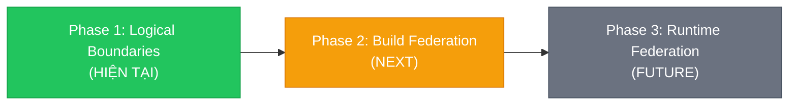
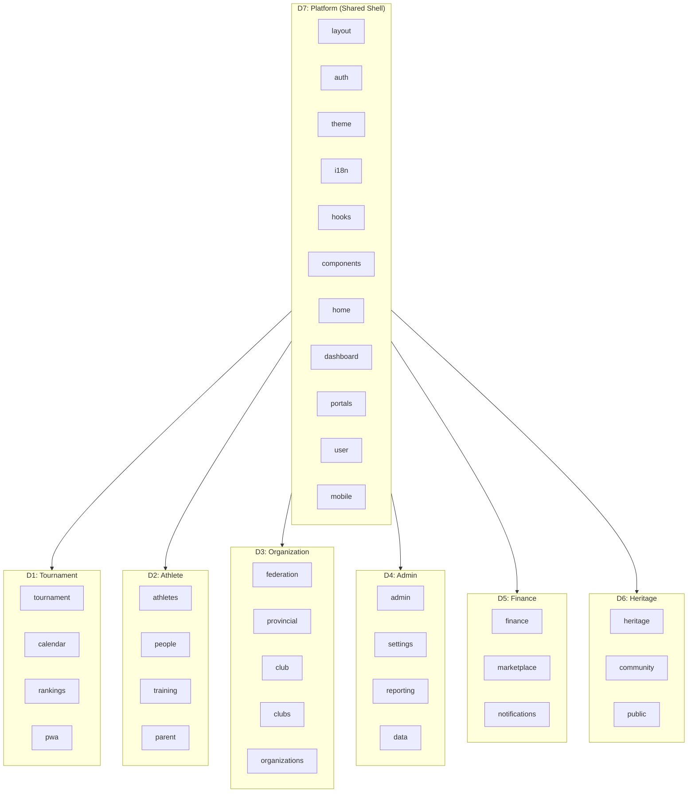
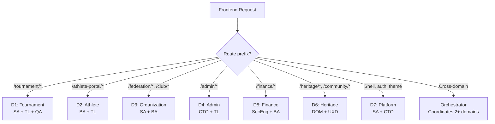

# VCT Platform — Micro Frontend Architecture

> **Vai trò**: Tài liệu kiến trúc Micro Frontend (MFE) — tham chiếu chính cho tất cả agent skills và development workflows.
>
> **Phạm vi**: Domain boundaries, Module Federation, shared shell, cross-domain contracts, build pipeline, migration path.
>
> **Liên kết**: [`vct-micro-frontend` SKILL](file:///d:/VCT%20PLATFORM/vct-platform/.agents/skills/vct-micro-frontend/SKILL.md) · [`vct-mfe-domain-owner` SKILL](file:///d:/VCT%20PLATFORM/vct-platform/.agents/skills/vct-mfe-domain-owner/SKILL.md)

---

## MỤC LỤC

| # | Phần | Mục đích |
|---|------|---------|
| 1 | [MFE Vision & Strategy](#1-mfe-vision--strategy) | Tầm nhìn và lộ trình MFE |
| 2 | [Domain Architecture](#2-domain-architecture) | 7 domains, module mapping, dependency |
| 3 | [Shared Shell Specification](#3-shared-shell-specification) | Platform shell contract |
| 4 | [Cross-Domain Contracts](#4-cross-domain-contracts) | TypeScript contracts, event bus |
| 5 | [Build & Deploy Pipeline](#5-build--deploy-pipeline) | Build strategy per phase |
| 6 | [MFE Guard Rails](#6-mfe-guard-rails) | Rules bắt buộc tuân thủ |
| 7 | [Migration Path](#7-migration-path) | Lộ trình 3 phases |
| 8 | [Agent Integration](#8-agent-integration) | Tích hợp với hệ thống AI agents |

---

## 1. MFE Vision & Strategy

### 1.1 Tại sao MFE?

VCT Platform có **34 feature modules** phục vụ **8 user roles** khác nhau. Khi platform scale:

| Problem | MFE Solution |
|---------|-------------|
| 1 bug trong Tournament → sập cả app | Error Boundary per domain → chỉ Tournament bị ảnh hưởng |
| Deploy fix nhỏ → rebuild toàn bộ | Independent domain builds → chỉ build domain liên quan |
| 2 teams sửa cùng file → merge conflict | Domain ownership → team chỉ touch code trong domain mình |
| Bundle size ngày càng lớn | Code splitting per domain → chỉ load domain user cần |
| Feature phức tạp → khó trace ownership | Domain registry → mọi module có owner rõ ràng |

### 1.2 MFE Maturity Phases



---

## 2. Domain Architecture

### 2.1 Domain Map



### 2.2 Route Ownership Matrix

| URL Pattern | Domain | Entry Module |
|-------------|--------|-------------|
| `/` | D7: Platform | `home` |
| `/login`, `/register`, `/forgot-password` | D7: Platform | `auth` |
| `/dashboard` | D7: Platform | `dashboard` |
| `/portal/*` | D7: Platform | `portals` |
| `/user/*` | D7: Platform | `user` |
| `/tournament/*` | D1: Tournament | `tournament` |
| `/referee-scoring/*` | D1: Tournament | `pwa` |
| `/scoreboard/*` | D1: Tournament | `pwa` |
| `/calendar/*` | D1: Tournament | `calendar` |
| `/rankings/*` | D1: Tournament | `rankings` |
| `/athlete-portal/*` | D2: Athlete | `athletes` |
| `/people/*` | D2: Athlete | `people` |
| `/training/*` | D2: Athlete | `training` |
| `/parent/*` | D2: Athlete | `parent` |
| `/federation/*` | D3: Organization | `federation` |
| `/provincial/*` | D3: Organization | `provincial` |
| `/club/*` | D3: Organization | `club` |
| `/admin/*` | D4: Admin | `admin` |
| `/settings/*` | D4: Admin | `settings` |
| `/finance/*` | D5: Finance | `finance` |
| `/marketplace/*` | D5: Finance | `marketplace` |
| `/heritage/*` | D6: Heritage | `heritage` |
| `/community/*` | D6: Heritage | `community` |
| `/public/*` | D6: Heritage | `public` |

---

## 3. Shared Shell Specification

### 3.1 Shell = Platform Domain (D7)

Shell cung cấp:

```typescript
// ========================================
// Shell Public API Contract
// ========================================

// Authentication Context
export { AuthProvider, useAuth } from 'features/auth'
export { useRouteActionGuard } from 'features/hooks/use-route-action-guard'

// Theme System
export { ThemeProvider, useTheme } from 'features/theme'

// Internationalization
export { I18nProvider, useI18n } from 'features/i18n'

// Layout & Navigation
export { ShellLayout } from 'features/layout'
export { routeRegistry, getSidebarGroups } from 'features/layout/route-registry'

// Shared Hooks (non-domain-specific)
export { useApiQuery } from 'features/hooks/useApiQuery'
export { usePagination } from 'features/hooks/usePagination'
export { useDebounce } from 'features/hooks/useDebounce'
export { useWebSocket } from 'features/hooks/useWebSocket'
export { useToast } from 'features/hooks/useToast'

// Shared Components
export { VCT_ErrorBoundary } from 'features/components/vct-error-boundary'
export { VCT_Icons } from 'features/components/vct-icons'
```

### 3.2 Shell Rules

| # | Rule | Description |
|---|------|-------------|
| SH1 | Shell KHÔNG chứa business logic | Chỉ layout + auth + theme + i18n + generic hooks |
| SH2 | Shell KHÔNG import từ feature domains | D7 không biết D1-D6 tồn tại |
| SH3 | Domain pages được compose vào Shell qua routing | `apps/next/app/{route}/page.tsx` |
| SH4 | Shell Error Boundary bọc ngoài cùng | Fallback toàn trang nếu Shell lỗi |
| SH5 | Domain Error Boundary bọc riêng | Mỗi domain pages có `error.tsx` riêng |

---

## 4. Cross-Domain Contracts

### 4.1 Contract Types

| Type | Location | Example |
|------|----------|---------|
| **Type Contract** | `packages/shared-types/` | `Athlete`, `Tournament`, `Club` interfaces |
| **API Contract** | Backend REST endpoints | `GET /api/v1/athletes/{id}` |
| **Event Contract** | Event bus messages | `{ type: 'tournament.completed', payload: { id } }` |
| **Route Contract** | URL patterns | `/athlete-portal/profile/{id}` |

### 4.2 Type Contract Pattern

```typescript
// packages/shared-types/src/athlete.ts
// ✅ Cross-domain type — MINIMAL, chỉ fields mà domain khác cần
export interface AthleteBasicInfo {
  id: string
  full_name: string
  belt_level: string
  club_name: string
  avatar_url?: string
}

// ❌ KHÔNG export internal types
// export interface AthleteTrainingPlan { ... }  // Thuộc D2 internal
```

### 4.3 Event Bus Pattern (Future)

```typescript
// Cross-domain events (sử dụng khi Phase 2+)
interface DomainEvent {
  type: string          // 'domain.action'
  payload: unknown
  source: string        // domain name
  timestamp: number
}

// Examples:
// { type: 'tournament.completed', payload: { tournamentId }, source: 'D1' }
// { type: 'athlete.belt_upgraded', payload: { athleteId, newBelt }, source: 'D2' }
// { type: 'finance.payment_received', payload: { invoiceId }, source: 'D5' }
```

---

## 5. Build & Deploy Pipeline

### 5.1 Phase 1 — Current (Monorepo Build)

```
npm run build
├── TypeScript check ALL packages
├── Next.js builds entire apps/next
├── Output: .next/ (single deployment unit)
└── Vercel deploys entire app
```

### 5.2 Phase 2 — Multi-Zone (Future)

```
// next.config.js — Shell app
module.exports = {
  async rewrites() {
    return [
      // Each domain can be a separate Next.js app
      { source: '/tournament/:path*', destination: `${TOURNAMENT_URL}/:path*` },
      { source: '/admin/:path*', destination: `${ADMIN_URL}/:path*` },
      { source: '/finance/:path*', destination: `${FINANCE_URL}/:path*` },
    ]
  }
}
```

### 5.3 Bundle Size Budgets per Domain

| Domain | Budget (gzipped) | Current Estimate |
|--------|-----------------|-----------------|
| D1: Tournament | 250KB | ~200KB |
| D2: Athlete | 150KB | ~120KB |
| D3: Organization | 200KB | ~180KB |
| D4: Admin | 300KB | ~250KB |
| D5: Finance | 200KB | ~150KB |
| D6: Heritage | 150KB | ~100KB |
| D7: Platform (Shell) | 200KB | ~180KB |
| **Shared (@vct/ui)** | 150KB | ~130KB |

---

## 6. MFE Guard Rails

### 6.1 Import Rules (NON-NEGOTIABLE)

| # | Rule | Enforcement |
|---|------|-------------|
| MFG-1 | Feature domain KHÔNG import từ feature domain khác | `npm run lint:mfe-boundaries` |
| MFG-2 | Feature domain CHỈ import từ: `@vct/ui`, Platform modules, `shared-types`, `shared-utils` | ESLint boundaries |
| MFG-3 | Cross-domain data access CHỈ qua shared hooks hoặc API calls | Code review |
| MFG-4 | Cross-domain navigation CHỈ qua URL routing (`router.push`) | Code review |
| MFG-5 | Shared state (Zustand) CHỈ cho Platform concerns (sidebar, theme, auth) | Architecture review |

### 6.2 Enforcement Scripts

```bash
# Check domain boundary violations
# Tournament domain should NOT import from athletes, finance, etc.
grep -rn "from '.*features/athletes" packages/app/features/tournament/ && echo "❌ MFG-1 VIOLATION" || echo "✅ CLEAN"
grep -rn "from '.*features/finance" packages/app/features/tournament/ && echo "❌ MFG-1 VIOLATION" || echo "✅ CLEAN"

# Generic check: no cross-domain imports between D1-D6
for domain in tournament athletes federation admin finance heritage; do
  for other in tournament athletes federation admin finance heritage; do
    if [ "$domain" != "$other" ]; then
      grep -rn "from '.*features/$other" "packages/app/features/$domain/" 2>/dev/null && echo "❌ $domain imports $other" || true
    fi
  done
done
```

### 6.3 Anti-Patterns

| # | Anti-Pattern | Detection | Fix |
|---|-------------|-----------|-----|
| MFA-1 | God Component spanning 2+ domains | Component imports from 2+ domain dirs | Split into domain-specific components |
| MFA-2 | Cross-domain Zustand store | Store imported by multiple domains | Use API/event bus instead |
| MFA-3 | Shared CSS class across domains | Non-`@vct/ui` CSS class used in multiple domains | Move to `@vct/ui` or use CSS Modules |
| MFA-4 | Cross-domain component import | `import { X } from '../other-domain/components/X'` | Use shared hook + local component |

---

## 7. Migration Path

### 7.1 Phase 1 → Phase 2 Preparation Checklist

```
□ Tất cả 34 modules đã được assign vào đúng domain
□ Không còn cross-domain imports giữa D1-D6
□ Mỗi domain có index.ts chỉ export public API
□ Shared hooks cover tất cả cross-domain data needs
□ Error boundaries wrap mỗi domain independently
□ Bundle analysis per domain available
□ CI/CD pipeline có lint:mfe-boundaries step
```

### 7.2 Phase 2 Implementation Steps

```
1. Extract Shell app (D7) thành standalone Next.js app
2. Configure Multi-Zone rewrites cho từng domain
3. Setup independent build pipeline per domain
4. Implement shared dependency versioning (@vct/ui, React)
5. Add contract testing between Shell and domains
6. Gradual migration: 1 domain at a time (start with smallest)
```

---

## 8. Agent Integration

### 8.1 Orchestrator MFE Routing

Khi Orchestrator nhận frontend request:



### 8.2 Skill Activation per Domain

| Request Type | Domain | Skills Activated |
|-------------|--------|-----------------|
| "Tạo trang giải đấu mới" | D1 | `vct-micro-frontend` → `vct-frontend` → `vct-realtime-scoring` |
| "Sửa form hồ sơ VĐV" | D2 | `vct-micro-frontend` → `vct-frontend` → `vct-ba` |
| "Thêm báo cáo admin" | D4 | `vct-micro-frontend` → `vct-frontend` → `vct-cto` |
| "Feature span Tournament + Athlete" | D1+D2 | `vct-mfe-domain-owner` → negotiate contract → implement separately |

---

## Tham khảo

- [Micro Frontends — Martin Fowler](https://martinfowler.com/articles/micro-frontends.html)
- [Module Federation — Webpack 5](https://webpack.js.org/concepts/module-federation/)
- [Next.js Multi-Zones](https://nextjs.org/docs/advanced-features/multi-zones)
- [Team Topologies — Matthew Skelton & Manuel Pais](https://teamtopologies.com/)
- VCT Frontend Architecture: [`docs/architecture/frontend-architecture.md`](file:///d:/VCT%20PLATFORM/vct-platform/docs/architecture/frontend-architecture.md)
- VCT Guard Rails: [`docs/architecture/architecture-guard-rails.md`](file:///d:/VCT%20PLATFORM/vct-platform/docs/architecture/architecture-guard-rails.md)
