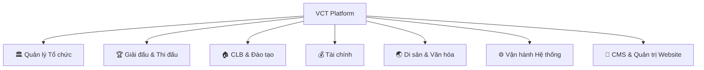
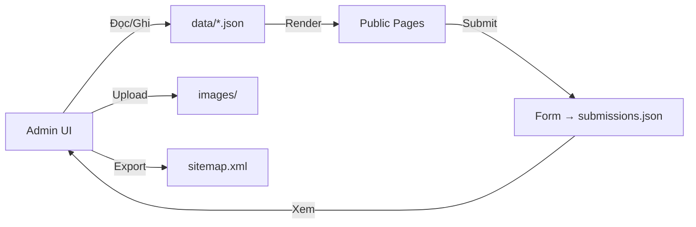

# Phân tích Nghiệp vụ & Cấu trúc Website — VCT Platform

## I. Tổng quan Nghiệp vụ

**VCT Platform** là nền tảng số hóa toàn diện cho **Võ Cổ Truyền Việt Nam**, phục vụ từ Liên đoàn Quốc gia đến từng CLB và VĐV.

### Các nhóm nghiệp vụ chính



| Nhóm | Mô tả | Phân hệ liên quan |
|------|--------|-------------------|
| **Quản lý Tổ chức** | LĐ Quốc gia → 34 LĐ Tỉnh → CLB → VĐV/HLV | Federation, Provincial |
| **Giải đấu** | Vòng đời từ đăng ký → bốc thăm → chấm điểm → kết quả | Tournament, Referee, Scoring |
| **CLB & Đào tạo** | Võ sinh, lớp học, điểm danh, thi đai, e-learning | Club, Athlete, Training |
| **Tài chính** | Thu-chi, hóa đơn, phí, tài trợ, ngân sách | Finance |
| **Di sản** | Phả hệ môn phái, bài quyền, hệ thống đai (14 cấp) | Heritage |
| **CMS Website** | Quản trị nội dung, blog, media, SEO, form, analytics | CMS Admin |
| **Hệ thống** | Multi-tenant, RBAC (12 vai trò), audit, feature flags | System Admin |

---

## II. Phân tích Website Hiện tại

### Cấu trúc file hiện có

```
vct-website/
├── index.html              ← Trang chủ (landing page)
├── pitch.html              ← Pitch Deck (8 tabs, 1508 dòng)
├── docs.html               ← Nghiệp vụ (15 sections, 486 dòng)
├── pricing.html            ← Báo giá (3 gói)
├── diagrams.html           ← Sơ đồ nghiệp vụ
├── vct-platform-pitch.html ← Bản cũ pitch (trùng lặp)
├── vct-platform-diagrams.html ← Bản cũ diagrams (trùng lặp)
├── vct-platform-nghiep-vu.html ← Bản cũ docs (trùng lặp)
├── css/style.css           ← Design system (434 dòng)
├── js/main.js              ← Shared JS (135 dòng)
└── .agents/                ← AI Agent skills & workflows
```

### Vấn đề hiện tại

| # | Vấn đề | Chi tiết |
|---|--------|----------|
| 1 | **File trùng lặp** | 3 file `vct-platform-*.html` là bản cũ, nội dung gần giống pitch/docs/diagrams |
| 2 | **Inline styles** | `docs.html` dùng inline CSS thay vì shared `style.css` |
| 3 | **Thiếu trang quan trọng** | Chưa có: Giới thiệu, Liên hệ, Demo, Blog, FAQ standalone |
| 4 | **SEO yếu** | Thiếu meta og:image, structured data, sitemap |
| 5 | **Thiếu tương tác** | Chưa có form liên hệ, CTA chuyển đổi rõ ràng |
| 6 | **Không có README** | Repository thiếu README.md giới thiệu dự án |
| 7 | **Không có CMS** | Mọi nội dung hardcode trong HTML, không có hệ thống quản trị nội dung |

---

## III. Cấu trúc Website Đề xuất

### Sitemap mới

```
vct-website/
├── index.html              ← Trang chủ (Landing Page)
├── about.html              ← [MỚI] Giới thiệu VCT Platform
├── features.html           ← [MỚI] Chi tiết 9 phân hệ & tính năng
├── pitch.html              ← Pitch Deck (giữ nguyên, tối ưu)
├── pricing.html            ← Bảng giá (giữ nguyên, bổ sung FAQ)
├── docs.html               ← Nghiệp vụ (refactor dùng shared CSS)
├── diagrams.html           ← Sơ đồ nghiệp vụ (giữ nguyên)
├── contact.html            ← [MỚI] Liên hệ & Demo
├── heritage.html           ← [MỚI] Di sản Võ Cổ Truyền
├── blog.html               ← [MỚI] Blog / Tin tức
├── README.md               ← [MỚI] README cho GitHub
├── admin/                  ← [MỚI] CMS - Quản trị Website
│   ├── index.html          ← Dashboard tổng quan
│   ├── pages.html          ← Quản lý trang
│   ├── blog.html           ← Quản lý bài viết / tin tức
│   ├── media.html          ← Thư viện media (ảnh, video)
│   ├── seo.html            ← Quản lý SEO
│   ├── forms.html          ← Xem submissions từ form liên hệ
│   ├── settings.html       ← Cài đặt website
│   └── analytics.html      ← Thống kê truy cập
├── css/
│   ├── style.css           ← Design system (mở rộng)
│   └── admin.css           ← [MỚI] Styles cho CMS admin
├── js/
│   ├── main.js             ← Shared JS (mở rộng)
│   └── admin.js            ← [MỚI] CMS admin JS
├── data/                   ← [MỚI] JSON data cho CMS
│   ├── pages.json          ← Cấu hình trang
│   ├── blog.json           ← Danh sách bài viết
│   ├── settings.json       ← Cài đặt chung
│   └── submissions.json    ← Form submissions
├── images/                 ← [MỚI] Thư mục hình ảnh
│   ├── og-image.png
│   └── ...
└── .agents/                ← AI Agent skills
```

### Chi tiết từng trang

---

#### 1. `index.html` — Trang chủ ✅ (đã có, cần tối ưu)
- Hero section với tagline hấp dẫn
- Stats bar (9 phân hệ, 12 vai trò, 34 tỉnh/thành...)
- 6 giá trị cốt lõi (cards)
- 4 bước quy trình (How it works)
- 9 phân hệ overview
- Pricing preview (3 gói)
- Use cases (3 personas)
- Tech stack
- CTA banner

> **Tối ưu**: Thêm meta OG tags, bổ sung link đến trang mới

---

#### 2. `about.html` — Giới thiệu 🆕
**Mục đích**: Giới thiệu chi tiết VCT Platform, đội ngũ, tầm nhìn

Sections:
- **Câu chuyện**: Tại sao xây dựng VCT Platform
- **Sứ mệnh**: Số hóa và bảo tồn Võ Cổ Truyền
- **Tầm nhìn**: Nền tảng quốc gia → quốc tế
- **Đội ngũ**: Founders, tech leads
- **Cột mốc**: Timeline phát triển (v1 → v7)
- **Đối tác**: LĐ Quốc gia, tỉnh/thành

---

#### 3. `features.html` — Chi tiết Tính năng 🆕
**Mục đích**: Deep-dive 9 phân hệ với screenshots/mockups

Sections:
- Navigation tabs cho 9 phân hệ
- Mỗi phân hệ: mô tả, tính năng chính, user flow, screenshots
- So sánh trước/sau khi dùng VCT Platform
- Banner CTA: "Đăng ký Demo"

---

#### 4. `pitch.html` — Pitch Deck ✅ (đã có, rất tốt)
8 tabs: Tổng quan, Phân hệ, Quy trình, Tương tác, Vai trò, Tổ chức, SOP, Công nghệ

> **Giữ nguyên** — đây là trang mạnh nhất

---

#### 5. `pricing.html` — Bảng giá ✅ (đã có, cần bổ sung)
- 3 gói: Free, Pro (2M/th), Enterprise (Liên hệ)
- ROI calculator
- Bổ sung: **FAQ về giá**, **Comparison table chi tiết**

---

#### 6. `docs.html` — Tài liệu Nghiệp vụ ✅ (đã có, cần refactor)
15 sections đầy đủ

> **Refactor**: Chuyển sang dùng shared `css/style.css` thay vì inline styles

---

#### 7. `contact.html` — Liên hệ & Demo 🆕
**Mục đích**: Chuyển đổi khách hàng tiềm năng

Sections:
- Form liên hệ (Tên, Tổ chức, Email, SĐT, Gói quan tâm, Nội dung)
- Thông tin liên hệ trực tiếp
- "Đặt lịch Demo" — form đặt lịch
- Bản đồ / Địa chỉ (nếu có)
- FAQ ngắn

---

#### 8. `heritage.html` — Di sản Võ Cổ Truyền 🆕
**Mục đích**: Showcase giá trị văn hóa, thu hút cộng đồng

Sections:
- Lịch sử Võ Cổ Truyền Việt Nam
- Hệ thống 14 cấp đai (bảng trực quan)
- Các bài quyền tiêu biểu
- Phả hệ môn phái (interactive tree)
- Gallery hình ảnh/video
- CTA: "Tham gia cộng đồng VCT"

---

#### 9. `blog.html` — Blog / Tin tức 🆕
**Mục đích**: Tin tức, bài viết về Võ Cổ Truyền và VCT Platform

Sections:
- Danh sách bài viết (grid cards với ảnh, tiêu đề, tóm tắt)
- Phân loại: Tin tức, Sự kiện, Hướng dẫn, Cộng đồng
- Phân trang / Load more
- Sidebar: Bài viết nổi bật, Tags

> **Dữ liệu**: Đọc từ `data/blog.json`, render bằng JavaScript

---

#### 10. `admin/` — CMS Quản trị Website 🆕
**Mục đích**: Hệ thống quản trị nội dung website — không cần sửa code HTML trực tiếp

##### 10.1 `admin/index.html` — Dashboard
- Thống kê tổng quan: tổng trang, bài viết, lượt truy cập, form submissions
- Bài viết gần đây
- Form chưa xử lý
- Quick actions: Tạo bài viết mới, Xem analytics

##### 10.2 `admin/pages.html` — Quản lý Trang
- Danh sách tất cả trang (index, about, features...)
- Chỉnh sửa meta tags (title, description, og:image)
- Bật/tắt trang (draft/published)
- Sắp xếp thứ tự menu navigation
- Preview trước khi publish

##### 10.3 `admin/blog.html` — Quản lý Bài viết
- CRUD bài viết: Tạo, Sửa, Xóa, Ẩn
- Rich text editor (Markdown hoặc WYSIWYG)
- Phân loại & tags
- Lên lịch đăng bài (schedule)
- Upload ảnh đại diện
- Trạng thái: Nháp → Chờ duyệt → Đã xuất bản → Đã ẩn

##### 10.4 `admin/media.html` — Thư viện Media
- Upload & quản lý ảnh, video
- Grid/List view với preview
- Tìm kiếm và lọc theo loại file
- Copy URL nhanh để chèn vào bài viết
- Tối ưu ảnh tự động (resize, compress)

##### 10.5 `admin/seo.html` — Quản lý SEO
- Chỉnh sửa meta tags cho từng trang
- Preview Google search snippet
- Kiểm tra: title length, description length, heading structure
- Sinh sitemap.xml tự động
- Quản lý robots.txt
- Structured data (JSON-LD) cho Organization, Website

##### 10.6 `admin/forms.html` — Form Submissions
- Xem danh sách form liên hệ đã gửi
- Lọc theo trạng thái: Mới / Đã xem / Đã phản hồi
- Chi tiết: Tên, Email, SĐT, Tổ chức, Nội dung, Thời gian
- Export CSV
- Đánh dấu & ghi chú

##### 10.7 `admin/settings.html` — Cài đặt Website
- Thông tin chung: Tên website, Logo, Favicon, Slogan
- Thông tin liên hệ: Email, SĐT, Địa chỉ, Social links
- Footer: Nội dung, links
- Cấu hình theme: Primary color, Dark/Light default
- Google Analytics tracking ID
- Cấu hình phân quyền admin (username/password)

##### 10.8 `admin/analytics.html` — Thống kê Truy cập
- Lượt truy cập theo ngày/tuần/tháng (biểu đồ)
- Top trang được xem nhiều nhất
- Nguồn truy cập (Direct, Search, Social, Referral)
- Thiết bị (Desktop vs Mobile)
- Trang thoát cao nhất

> **Kiến trúc CMS**: Static-site CMS — dữ liệu lưu trong `data/*.json`, admin UI đọc/ghi qua `localStorage` hoặc GitHub API (cho deployment). Không cần server backend riêng.



---

## IV. Luồng người dùng chính (User Flows)

```
Khách hàng mới:
  Landing (index) → Features → Pricing → Contact (Demo)

Stakeholder / Nhà đầu tư:
  Landing → Pitch Deck → Pricing → Contact

Kỹ thuật / Developer:
  Landing → Docs (Nghiệp vụ) → Diagrams → Pitch (Tech tab)

Cộng đồng Võ thuật:
  Landing → Heritage → Blog → Features (CLB/VĐV) → Contact

Quản trị viên Website (CMS):
  admin/login → Dashboard → Blog (CRUD) → Media → SEO → Forms → Settings
```

---

## V. Ưu tiên Triển khai

| Phase | Công việc | Ưu tiên |
|-------|-----------|---------|
| **Phase 1** | Xóa 3 file trùng lặp `vct-platform-*.html` | 🔴 Cao |
| **Phase 1** | Refactor `docs.html` dùng shared CSS | 🔴 Cao |
| **Phase 1** | Thêm `README.md` | 🔴 Cao |
| **Phase 1** | Tối ưu SEO cho tất cả trang | 🟡 Trung bình |
| **Phase 2** | Tạo `about.html` | 🟡 Trung bình |
| **Phase 2** | Tạo `contact.html` với form | 🟡 Trung bình |
| **Phase 2** | Tạo `features.html` | 🟡 Trung bình |
| **Phase 3** | Tạo `heritage.html` | 🟡 Trung bình |
| **Phase 3** | Tạo `blog.html` + `data/blog.json` | 🟡 Trung bình |
| **Phase 3** | Thêm thư mục `images/` với assets | 🟢 Thấp |
| **Phase 4** | CMS: `admin/index.html` Dashboard | 🟡 Trung bình |
| **Phase 4** | CMS: `admin/blog.html` CRUD bài viết | 🟡 Trung bình |
| **Phase 4** | CMS: `admin/pages.html` Quản lý trang | 🟡 Trung bình |
| **Phase 4** | CMS: `admin/media.html` Thư viện media | 🟡 Trung bình |
| **Phase 4** | CMS: `admin/seo.html` SEO manager | 🟢 Thấp |
| **Phase 4** | CMS: `admin/forms.html` Form submissions | 🟢 Thấp |
| **Phase 4** | CMS: `admin/settings.html` Cài đặt | 🟢 Thấp |
| **Phase 4** | CMS: `admin/analytics.html` Thống kê | 🟢 Thấp |
