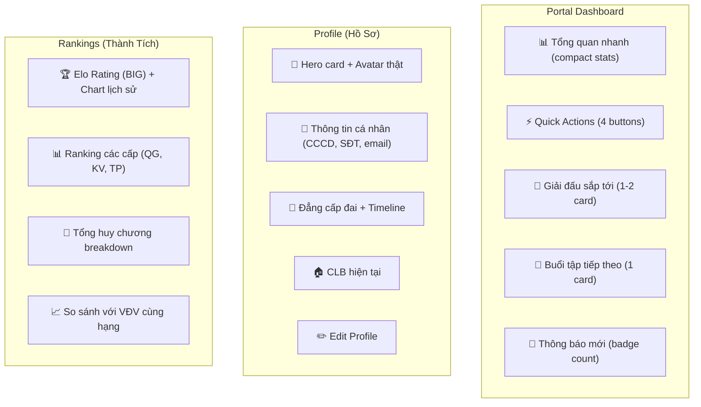

# 🥋 Phản Biện & Đề Xuất Nâng Cấp Mobile App — Vai Trò Vận Động Viên

## Phạm vi rà soát

Đã review toàn bộ **16+ files** trong `packages/app/features/mobile/`, gồm 5 athlete screens, hook layer, mock data, API client, routes, 2 business analysis docs, và 2 walkthroughs.

---

## I. PHẢN BIỆN — Những Vấn Đề Hiện Tại

### 🔴 Mức Nghiêm Trọng: Critical

#### 1. Dữ liệu 70% vẫn là mock — VĐV thấy thông tin giả

| Hook | API thật | Mock fallback | Vấn đề |
|------|----------|---------------|--------|
| `useAthleteProfile` | ✅ `/athlete-profiles/me` | skills, goals, beltHistory luôn mock | VĐV thấy kỹ năng/mục tiêu "đẹp" nhưng giả |
| `useAthleteTournaments` | ✅ `/tournament-entries` | ⬜ fallback | OK, nhưng docs status chưa upload thật |
| `useAthleteTraining` | ✅ `/training-sessions` | ⬜ fallback | OK |
| **`useAthleteResults`** | ❌ **100% mock** | Toàn bộ | VĐV thấy huy chương giả, ELO giả |
| **`useNotifications`** | ❌ **100% mock** | Toàn bộ | Thông báo hoàn toàn giả |

> [!CAUTION]
> **`useAthleteResults()`** ([L198-204](file:///d:/VCT%20PLATFORM/vct-platform/packages/app/features/mobile/useAthleteData.ts#L198-L204)) KHÔNG GỌI API, trả về mock data cứng. VĐV sẽ thấy "2 HCV, 2 HCB, 1 HCĐ" cho dù họ chưa thi đấu lần nào.

#### 2. RANKING_SNAPSHOT hardcode — xếp hạng không thật

Trong [athlete-rankings-screen.tsx](file:///d:/VCT%20PLATFORM/vct-platform/packages/app/features/mobile/athlete/athlete-rankings-screen.tsx#L15-L19):
```typescript
const RANKING_SNAPSHOT = [
  { label: 'Toàn quốc (ĐK Nam 60kg)', rank: '#12', trend: '↑ 3' },
  { label: 'Khu vực phía Nam', rank: '#5', trend: '↑ 1' },
  ...
]
```
→ **Mọi VĐV đều thấy mình xếp #12 toàn quốc, #5 khu vực** — hoàn toàn sai lệch.

#### 3. Không có tính năng upload hồ sơ thực tế

Checklist hồ sơ thi đấu (khám SK, bảo hiểm, CCCD, ảnh thẻ) chỉ hiển thị trạng thái ✅/❌ từ API. **Không có UI để VĐV chụp ảnh/upload giấy tờ** — đây là nghiệp vụ cốt lõi theo quy chế LĐVCTTVN.

#### 4. AthleteProfile chưa liên kết User đầy đủ

Backend `AthleteProfile` chưa trả về `skills`, `goals`, `beltHistory` → frontend phải hardcode. Cần API mở rộng trước khi mobile có dữ liệu thật.

---

### 🟡 Mức Trung Bình: Important

#### 5. UX trùng lặp nghiêm trọng giữa 3 màn hình

| Dữ liệu | Portal | Profile | Rankings |
|----------|--------|---------|----------|
| Hero card (tên, CLB, đai, ELO) | ✅ | ✅ (copy) | — |
| Stats row (giải đấu, huy chương, tỷ lệ tập) | ✅ | ✅ (copy) | ✅ (copy) |
| Skill bars | ✅ | — | ✅ (copy) |
| Goals | ✅ | — | ✅ (copy) |
| Belt timeline | ✅ | 3 items | — |

→ VĐV thấy **cùng một dữ liệu lặp lại** ở 3 nơi, gây confusing và wasted screen space.

#### 6. Không có Offline-first

API client dùng `fetch()` thuần — mất mạng = app trắng. Tại sân vận động/nhà thi đấu, mạng thường rất yếu.

#### 7. Thiếu Deep navigation — không xem chi tiết được

- Click vào giải đấu → **không mở chi tiết** (bracket, lịch thi, đối thủ)
- Click vào kết quả → **không xem trận đấu cụ thể**
- Click vào buổi tập → **không xem nội dung tập**

#### 8. Notifications không push thật

`useNotifications()` hoàn toàn local state — không có WebSocket, không có Push Notification, không có polling. VĐV phải mở app mới biết có thông báo.

#### 9. Thiếu tính năng E-Learning / Học bài quyền

Sidebar (web) đã liệt kê E-Learning, nhưng mobile **không có màn hình nào**. VĐV không thể xem video bài quyền trên điện thoại.

---

### 🟢 Mức Nhẹ: Nice-to-have

#### 10. `MOCK_TYPE_BREAKDOWN` import trực tiếp — không từ API
[athlete-training-screen.tsx L8](file:///d:/VCT%20PLATFORM/vct-platform/packages/app/features/mobile/athlete/athlete-training-screen.tsx#L8) import `MOCK_TYPE_BREAKDOWN` trực tiếp thay vì tính từ sessions.

#### 11. Không có animation khi scroll
ScrollView thuần, không có `Animated.ScrollView`, parallax header, hay sticky section titles.

#### 12. Elo History "placeholder" từ bản v1 vẫn còn
[athlete-rankings-screen.tsx L91-97](file:///d:/VCT%20PLATFORM/vct-platform/packages/app/features/mobile/athlete/athlete-rankings-screen.tsx#L91-L97): `EmptyState` "Đang phát triển" — cần thay bằng biểu đồ thật hoặc bỏ.

---

## II. ĐỀ XUẤT NÂNG CẤP — Roadmap Ưu Tiên

### Phase 1: Data-First — Xóa Mock, Kết Nối Thật (Sprint 1-2)

| # | Task | Effort | Impact |
|---|------|--------|--------|
| 1.1 | **Backend**: Mở rộng `AthleteProfile` API trả `skills`, `belt_history`, `goals` | L | 🔴 Critical |
| 1.2 | **Backend**: Tạo endpoint `/api/v1/match-results?athleteId=` | M | 🔴 Critical |
| 1.3 | **Backend**: Tạo endpoint `/api/v1/rankings?athleteId=` | M | 🔴 Critical |
| 1.4 | Hook: Wire `useAthleteResults()` vào API thật | S | 🔴 Critical |
| 1.5 | Hook: Wire `useNotifications()` vào real endpoint (SSE/polling) | M | 🟡 |
| 1.6 | Xóa `RANKING_SNAPSHOT` hardcode, fetch data thật | S | 🔴 Critical |
| 1.7 | Tính `MOCK_TYPE_BREAKDOWN` từ sessions thay vì import mock | S | 🟢 |

### Phase 2: Upload & Document Management (Sprint 2-3)

| # | Task | Effort | Impact |
|---|------|--------|--------|
| 2.1 | **Upload screen**: Camera + Gallery picker cho 4 loại giấy tờ | L | 🔴 Critical |
| 2.2 | Backend: File upload endpoint + storage (S3/local) | L | 🔴 Critical |
| 2.3 | Document preview & re-upload | M | 🟡 |
| 2.4 | Push notification khi hồ sơ được duyệt/từ chối | M | 🟡 |

### Phase 3: Deep Navigation & Detail Screens (Sprint 3-4)

| # | Task | Effort | Impact |
|---|------|--------|--------|
| 3.1 | **Tournament Detail screen**: bracket, lịch thi, đối thủ | L | 🟡 |
| 3.2 | **Match Detail screen**: điểm, video replay, trọng tài | L | 🟡 |
| 3.3 | **Training Detail screen**: nội dung tập, checklist kỹ thuật | M | 🟡 |
| 3.4 | Navigation: tap card → navigate to detail | S | 🟡 |

### Phase 4: Offline-First & Performance (Sprint 4-5)

| # | Task | Effort | Impact |
|---|------|--------|--------|
| 4.1 | React Query + cache persistence (AsyncStorage) | M | 🟡 |
| 4.2 | Offline queue cho tournament registration | M | 🟡 |
| 4.3 | Image caching (FastImage hoặc expo-image) | S | 🟢 |
| 4.4 | Skeleton → Stale-While-Revalidate pattern | M | 🟢 |

### Phase 5: UX Polish & New Features (Sprint 5-6)

| # | Task | Effort | Impact |
|---|------|--------|--------|
| 5.1 | **De-duplicate** Portal/Profile/Rankings — mỗi screen có identity riêng | M | 🟡 |
| 5.2 | **E-Learning screen**: video bài quyền, progress tracking | L | 🟡 |
| 5.3 | Elo History chart (victory-native hoặc react-native-chart-kit) | M | 🟢 |
| 5.4 | Push Notifications integration (Expo Notifications) | L | 🟡 |
| 5.5 | Parallax hero header + sticky section titles | S | 🟢 |
| 5.6 | Compare chỉ số với VĐV cùng hạng cân | M | 🟢 |
| 5.7 | QR code check-in cho buổi tập | M | 🟢 |

---

## III. ĐỀ XUẤT KIẾN TRÚC LẠI 3 MÀN HÌNH CHÍNH

Hiện tại Portal, Profile, Rankings quá giống nhau. Đề xuất tách biệt rõ ràng:



---

## IV. TÓM TẮT ĐÁNH GIÁ

| Tiêu chí | Điểm hiện tại | Mục tiêu |
|----------|---------------|----------|
| **API Integration** | ⭐⭐☆☆☆ (30% thật) | ⭐⭐⭐⭐⭐ (100%) |
| **Data Accuracy** | ⭐☆☆☆☆ (mock everywhere) | ⭐⭐⭐⭐⭐ |
| **Feature Coverage** | ⭐⭐⭐☆☆ (thiếu upload, detail, elearning) | ⭐⭐⭐⭐☆ |
| **UX Consistency** | ⭐⭐⭐☆☆ (trùng lặp nhiều) | ⭐⭐⭐⭐⭐ |
| **Offline Support** | ⭐☆☆☆☆ (không có) | ⭐⭐⭐⭐☆ |
| **UI Polish** | ⭐⭐⭐⭐☆ (SVG icons, haptics, a11y) | ⭐⭐⭐⭐⭐ |
| **Navigation Depth** | ⭐⭐☆☆☆ (flat, no detail) | ⭐⭐⭐⭐☆ |
| **Push Notifications** | ⭐☆☆☆☆ (mock only) | ⭐⭐⭐⭐☆ |

> [!IMPORTANT]
> **Ưu tiên #1 tuyệt đối**: Xóa mock data khỏi `useAthleteResults()` và `RANKING_SNAPSHOT` — đây là vấn đề **sai thông tin cho người dùng**, không chỉ là thiếu tính năng.

> [!TIP]
> **Điểm mạnh cần giữ**: SVG icon system, haptic feedback, accessibility labels, theme system, và mock fallback pattern. Kiến trúc `withMockFallback()` rất tốt — chỉ cần thêm API endpoints phía backend là mobile sẽ tự chuyển sang dữ liệu thật.
